# LEAFWIND

*A little monkey. A big wind. One leaf.*

A physics-driven 2D jungle platformer in C++17, built on SFML 2.6 and Box2D 2.4.
Swing on vines, bounce on mushrooms, ride floating logs, tip see-saws and
counterweight old mill lifts across ten hand-made levels.

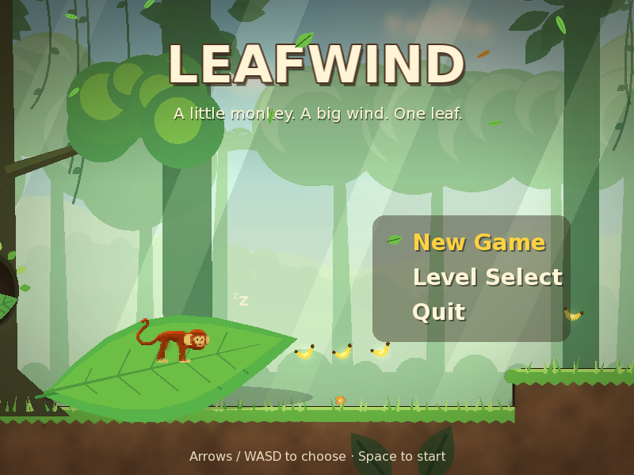

## The story

Every night Pip — the smallest monkey in the Home Tree, and the only one afraid
of heights — sleeps on Nana Fig's big green leaf. One night the Big Wind takes
it. Nana is too old to chase it, so Pip goes instead: through the Vine Grove,
across the Gully, down the river, up the Windy Cliffs and all the way to the
top of the Storm Tree. Along the way Pip keeps finding signs that another
monkey made this same journey, a long time ago…

The story is told through short cards between levels and signposts inside them.

| | |
|---|---|
| 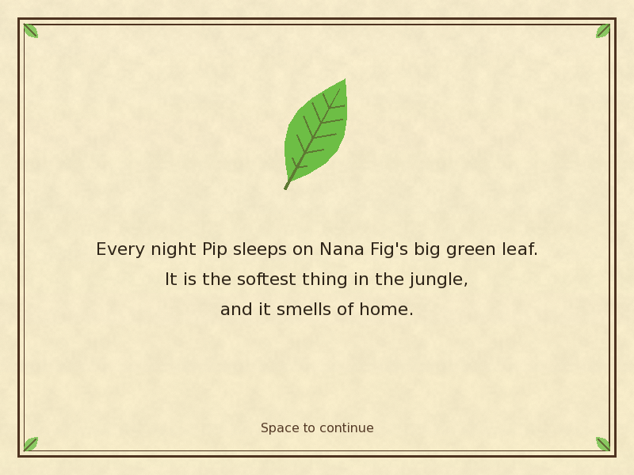 | 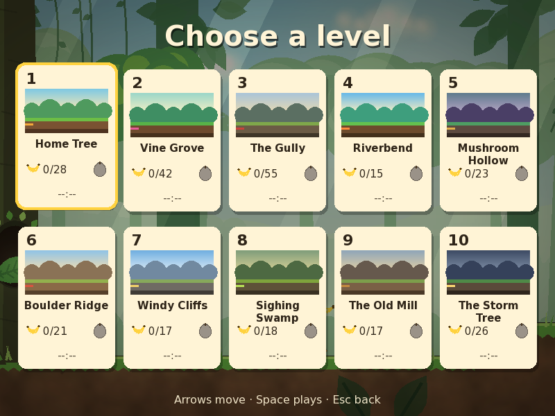 |

## The levels

Each level introduces one new mechanic and mixes it with the ones before.

| # | Level | New mechanic | |
|---|---|---|---|
| 1 | **Home Tree** | Running, variable-height jumps, branches you can jump up through, bananas and a hidden golden fig | 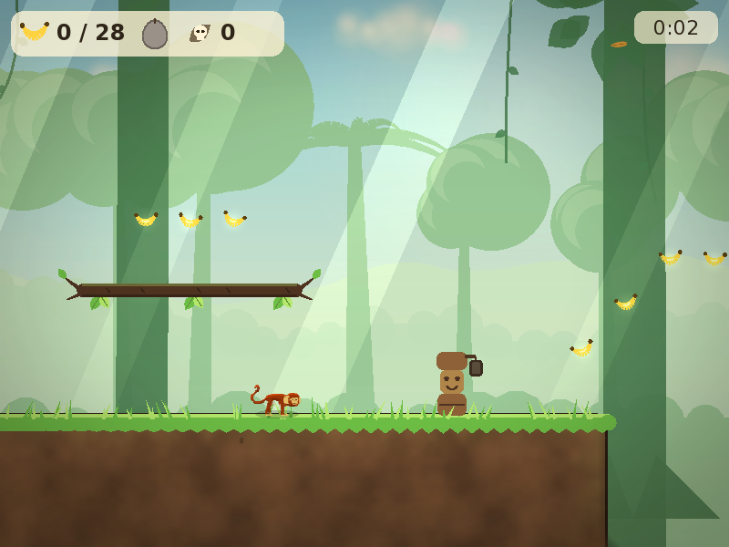 |
| 2 | **Vine Grove** | Vines: grab, pump the swing, climb up and down, let go with momentum | 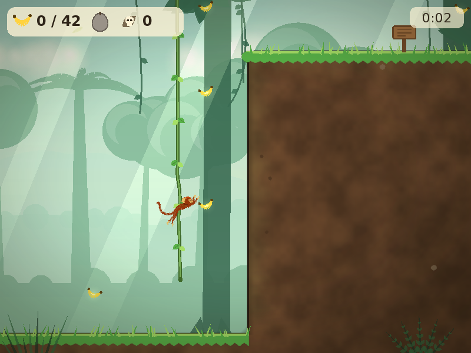 |
| 3 | **The Gully** | Sagging rope bridges and thorns | 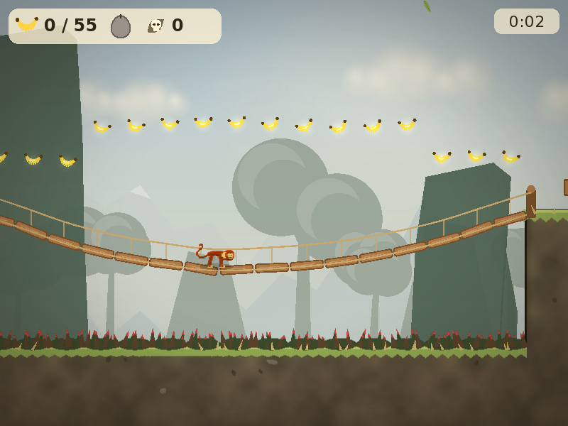 |
| 4 | **Riverbend** | Swimming, currents and floating logs | 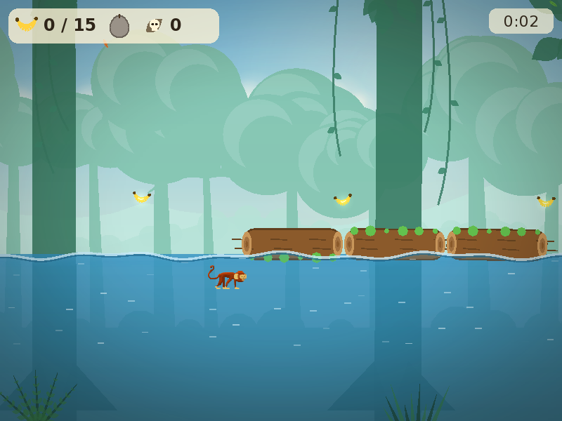 |
| 5 | **Mushroom Hollow** | Bouncy mushrooms (hold jump for a big bounce) and beetles you can stomp | 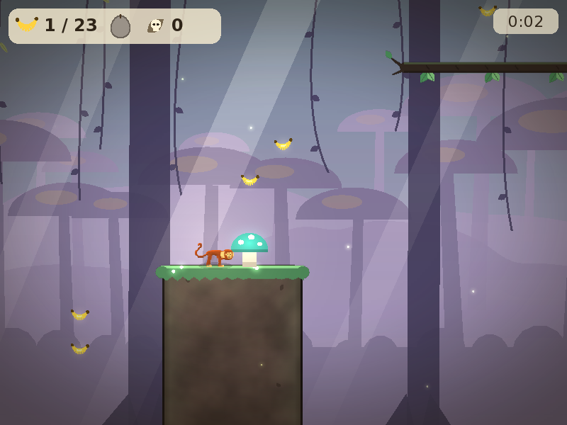 |
| 6 | **Boulder Ridge** | Pushable crates and see-saws | 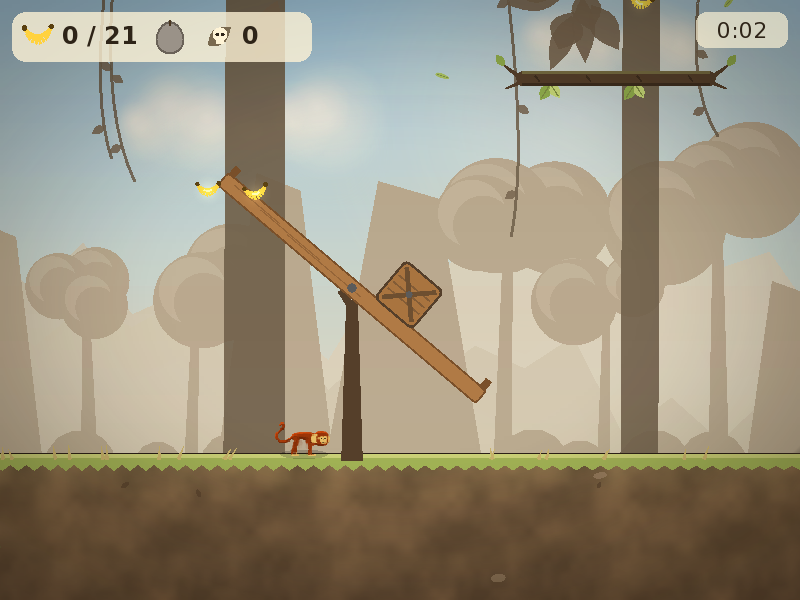 |
| 7 | **Windy Cliffs** | Headwinds and tailwinds, updrafts and crumbling ledges | 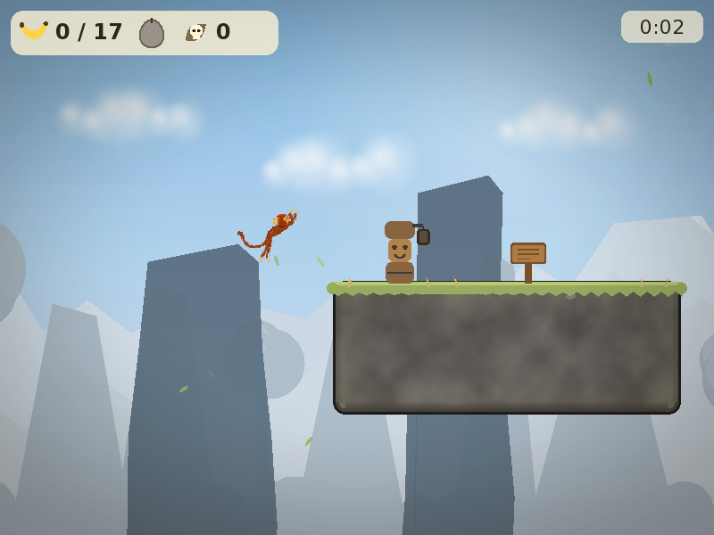 |
| 8 | **Sighing Swamp** | Moving lily pads and hanging logs that fall | 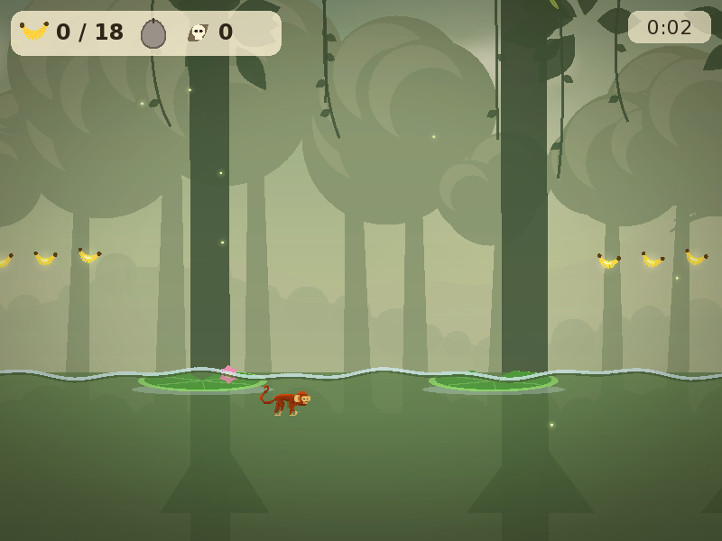 |
| 9 | **The Old Mill** | Pulley counterweights, rolling boulders and slopes | 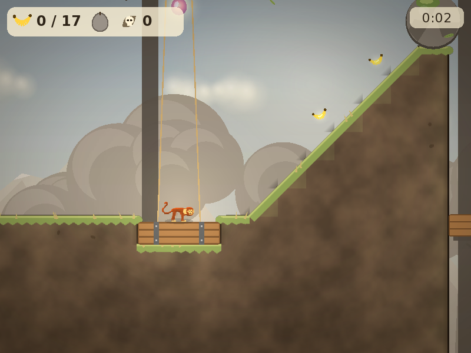 |
| 10 | **The Storm Tree** | Timed gusts, and everything else, in a final vertical climb | 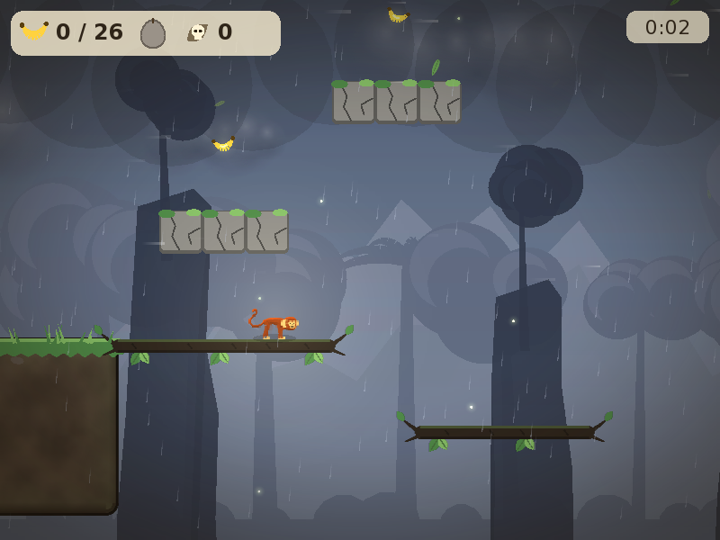 |

There are 262 bananas and ten golden figs to find. Checkpoints, deaths, best
times and collectibles are saved per level.

All world graphics are generated at runtime: parallax jungle layers per biome,
textured terrain with grass caps, vines, water, particles and lighting. The
sound effects and music are synthesized too. The only image assets are the
original hand-drawn monkey sprites in `data/apa_*.tga`.

## Controls

| Action | Keyboard | Gamepad |
|---|---|---|
| Move | ← → or A D | Left stick / D-pad |
| Jump, let go of a vine, hop out of water | Space, Z or K | A |
| Climb up a vine, swim up | ↑ or W | Stick up |
| Climb down, drop through a branch, dive | ↓ or S | Stick down |
| Restart from checkpoint | R | Back |
| Pause | Esc | Start |
| Volume down / up, toggle music | - / =, M | |

## Building

Dependencies: CMake ≥ 3.16, a C++17 compiler, SFML 2.6 and Box2D 2.4.

```sh
# Debian/Ubuntu
sudo apt install cmake g++ libsfml-dev libbox2d-dev

cmake -B build
cmake --build build -j
./build/monkey_game          # run from the repository root so data/ is found
```

With Nix: `nix run` builds and runs the game, and `nix develop` gives a dev
shell with the QA tools.

Progress is saved to `$XDG_DATA_HOME/leafwind/save.txt` (set `LEAFWIND_SAVE`
to choose another path).

### Command-line options

| Option | Purpose |
|---|---|
| `--play <N>` | Skip the menus and start level N |
| `--mute` | Disable audio |
| `--validate-levels` | Parse and check every level file |
| `--test-physics [N]` | Headless physics sanity run |
| `--screenshot <what> <frames> <out.png> [--place <tx> <ty>]` | Render a screenshot. `<what>` is `title`, `select`, `credits`, `card:N`, `pause:N`, `results:N` or a level number |

The README screenshots were taken with, for example:

```sh
xvfb-run -a -s "-screen 0 800x600x24" ./build/monkey_game --mute \
    --screenshot 3 180 docs/screenshots/level03.png --place 97 15
```

## Tests

```sh
cd build && ctest --output-on-failure
```

The suite covers level parsing and validation, the movement numbers and each
mechanic, the save file and the synthesizer. It also runs scripted playthroughs
that finish all ten levels on the real physics, a full menu-to-results flow
test and a visual regression test. The flow and visual tests run under
`xvfb-run`.

## Project layout

```
src/core/    simulation: level loader, Box2D world and mechanics, player controller, saves
src/gfx/     procedural renderer: backgrounds, terrain, particles, camera
src/audio/   synthesized sound effects and music
src/game/    screens, menus and game flow, input
data/        monkey sprites, fonts, level files (data/levels/levelNN.txt)
docs/        DESIGN.md (story, mechanics, level format, art direction) and screenshots
tests/       unit, route-bot, flow and visual tests
```

To make your own levels, see the level format in
[docs/DESIGN.md](docs/DESIGN.md) §4.1. The format is plain ASCII: one
character per tile, plus a small header for names, story cards and objects.

## History

This started in 2010 as a small prototype: a room with a rope and some floors,
built to try physics as a platforming mechanic. In 2026 it was expanded into
Leafwind. The monkey is the same one.
